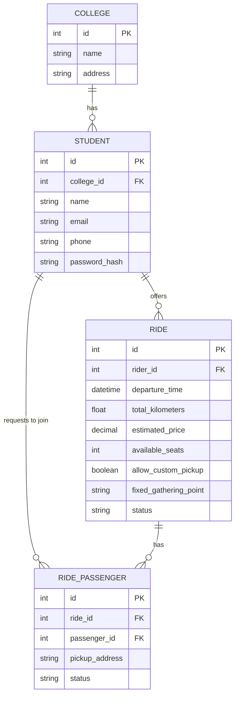

# BlablaIF Architecture Document

## Overview
BlablaIF is a carpool ride system designed exclusively for IFSP (Instituto Federal de São Paulo) campuses. 
The system connects students who want to offer rides with students looking for rides to or from the campus.

## Tech Stack
* **Backend**: FastAPI (Python)
* **Frontend**: Next.js (React)

## Entity-Relationship (ER) Model

The core database architecture revolves around the College (Campus). Every user (student) belongs to a college, and rides are inherently tied to students who attend the college.

### Entities

1. **College (Campus)**
   - The central entity. Represents an IFSP campus.
   - `id` (PK)
   - `name` (e.g., "IFSP - Campus São Paulo")
   - `address`

2. **Student**
   - Represents users of the application. A student can act as a rider (driver) or passenger.
   - `id` (PK)
   - `college_id` (FK -> College.id)
   - `name`
   - `email`
   - `phone`
   - `password_hash`

3. **Ride**
   - An announcement created by a student offering a ride.
   - `id` (PK)
   - `rider_id` (FK -> Student.id)
   - `departure_time` (Datetime)
   - `total_kilometers` (Float, used to calculate price)
   - `estimated_price` (Decimal) - The cost of the ride based on the total kilometers.
   - `available_seats` (Integer)
   - `allow_custom_pickup` (Boolean) - Rider allows passengers to set their own pickup locations.
   - `fixed_gathering_point` (String, nullable) - If `allow_custom_pickup` is false, this is the designated meeting point.
   - `status` (Enum: Scheduled, InProgress, Completed, Cancelled)

4. **RidePassenger (Join Request)**
   - Whenever a student joins a ride, a record is created linking them to the ride. This includes the passenger's desired pickup address.
   - `id` (PK)
   - `ride_id` (FK -> Ride.id)
   - `passenger_id` (FK -> Student.id)
   - `pickup_address` (String) - Specified by the passenger when they request to join.
   - `status` (Enum: Pending, Accepted, Rejected, Cancelled)

### ER Diagram

### Business Rules & Flow
1. A Student signs up and is linked to their respective IFSP campus (College).
2. A Student (Rider) creates a Ride announcement, defining the total kilometers, departure time, and whether they accept custom pickup locations or have a fixed gathering point. The price is calculated based on distance.
3. Another Student (Passenger) browses available rides and requests to join one. If they request to join, they specify their `pickup_address` (or accept the fixed gathering point if custom pickups aren't allowed).
4. The Rider reviews pending `RidePassenger` requests and can accept or reject them. If `allow_custom_pickup` is true, the rider decides whether taking the specified route is feasible.
5. Once accepted, the passenger is confirmed for the ride.
